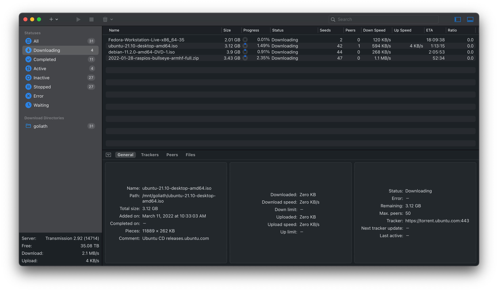

# TransmissionRemote



## Motivation

TransmissionRemote is a macOS client for [transmission-daemon](https://transmissionbt.com). It is heavily inspired by [Transmission Remote GUI](https://github.com/transmission-remote-gui/transgui), which is fast and has all necessary functionality. Unfortunately, its macOS version uses really outdated technologies and lacks some native system features like dark mode support. But even more important, Transmission Remote GUI is 32bit (can't be changed), and therefore it won't work on 10.15+ at all. So, I decided to write a native transmission remote client. For now it has just a small set of essential features, ~~but more will be added over time~~.

## Features

Main features:

* Support for both `.torrent` files and magnet/torrent links
* All essential operations like add/remove/start/stop torrents, etc.
* Search, filtering, and sorting
* Access to torrent location (requires configuring path mapping)

UI:

* Clean and minimalistic UI, designed with Apple guidelines in mind
* Dark mode support
* Menubar icon with stats and ability to start/stop all torrents

macOS specific:

* Sandbox
* Exposing all torrent files to Spotlight, so you can find and open them instantly without even touching the program itself

## Requirements

TransmissionRemote supports macOS Big Sur (11) and higher.

## Installation

Just grab the [app](https://github.com/cdzombak/TransmissionRemote/releases/latest) from Releases section, and unzip it in `/Applications` folder (or wherever else you want).

## Building from source

Download source and build dependencies:

```bash
$ git clone https://github.com/cdzombak/TransmissionRemote.git
$ cd TransmissionRemote
$ carthage bootstrap --platform macOS --no-use-binaries --use-xcframeworks
```

Then just open `TransmissionRemote.xcodeproj` file in Xcode and you are ready to go.

## License

[MIT](LICENSE)
